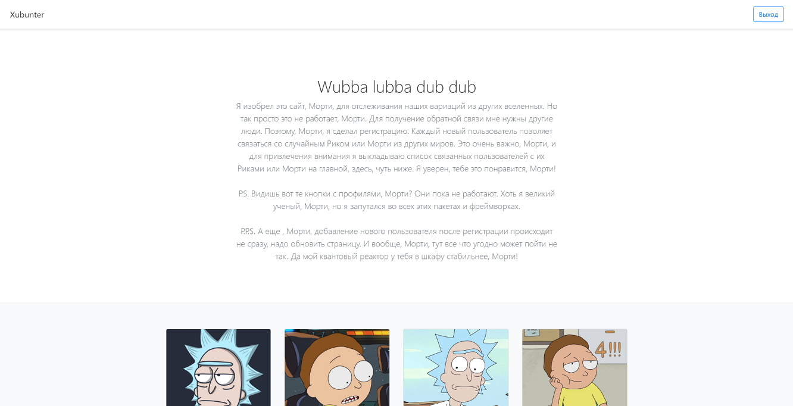
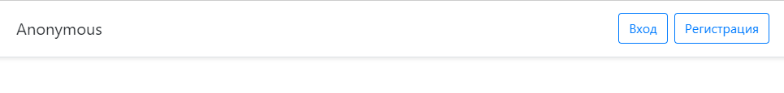
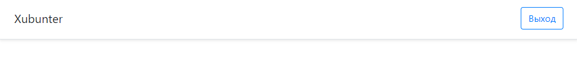

# web-app
Тестовое задание №5 
При разработке использовались:
* Express.js
* ejs
* Стандартные примеры с сайта bootstrap
* PostgreSQL

Функционал реализован не полностью, отсутствуют профиля пользователей.

Бекап базы данных находится в папке data_base.

На сайте доступна авторизация и вход в аккаунт. Каждый новый пользователь создает новую случайную карточку. 

При авторизации ник пользователя отображается в шапке.

